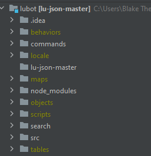

This is a LEGO Universe Discord Bot.\
To run this program successfully you must:
1. Install Node.js\
   How to do this is all over the internet
2. Install discord.js\
   `npm i discord.js`
3. Import https://github.com/xiphoseer/lu-json \
Keep the lu-json files in the same directory as the rest of the project. From index.js as seen below: \
   
   
4. You NEED a config.json including several values such as the login token.\
Your config file should look similar to this:

```yaml
{
  {
    "prefix": "!",
    "startupStatus": "LEGO Universe",
    "iconURL": "https://cdn.discordapp.com/attachments/641133444746838016/813621671461781544/circle-cropped_1.png",
    "nexusLink": "https://discord.com/api/oauth2/authorize?client_id=813618765685456916&permissions=52288&scope=bot",
    "token": "Lorem ipsum dolor sit amet",
    "bot_info": {
      "name": "Nexus Force",
      "version": 1.0
    },
    "exclude": [
        "items", "setpfp", "status", "play", "displaykit"
    ],
    "owner": [
        "703120460023463986",
        "789705048035688458"
    ],

  }
}
```
5. You can type `node index.js` in the terminal or run it through your IDE or however you prefer

I am aware the overall format of this project is not pretty (as well as some of the code) and a rewrite is definitely planned. All the random files in the main directory are me messing with the client to get json data that was not easily avaiable in lu-json.

If you have any questions, suggestions, or complains feel free to contact me on Discord at `MasterTemple#0233`  :)


